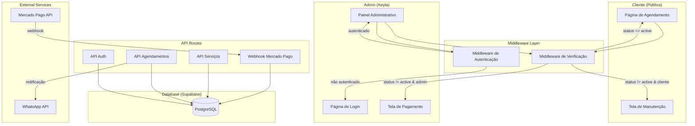
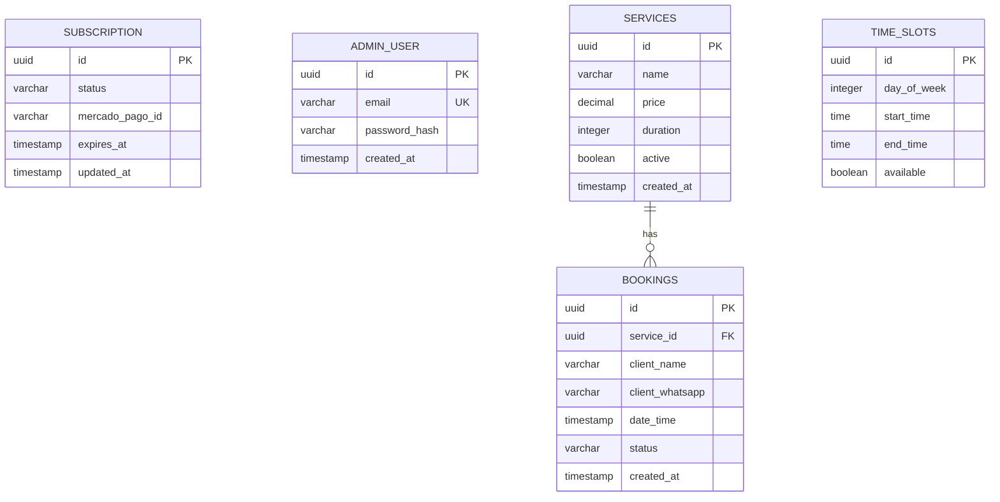

# Design Document: Agendamento Profissional

## Overview

Este documento descreve a arquitetura técnica do Web App de Agendamento Profissional (SaaS) para a profissional de beleza Keyla. O sistema é construído com Next.js, Tailwind CSS e Supabase, implementando um mecanismo de "Kill Switch" que bloqueia totalmente o acesso quando a assinatura do Mercado Pago não está ativa.

A arquitetura prioriza:
- **Proteção de receita**: Bloqueio total sem pagamento
- **Experiência do usuário**: Agendamento em 3 cliques
- **Automação**: Liberação automática via webhooks
- **Segurança**: Autenticação robusta e validação de webhooks

## Architecture



## Components and Interfaces

### 1. Middleware de Verificação de Assinatura

```typescript
// middleware/subscriptionCheck.ts
interface SubscriptionStatus {
  status: 'active' | 'inactive' | 'expired' | 'trial';
  expiresAt: Date | null;
  trialStartedAt: Date | null;
  trialDaysRemaining: number | null;
  mercadoPagoId: string | null;
}

interface MiddlewareResponse {
  allowed: boolean;
  redirectTo?: string;
  message?: string;
}

// Função executada antes de cada requisição
async function checkSubscription(
  requestPath: string,
  isAdminRoute: boolean
): Promise<MiddlewareResponse>
```

### 2. Webhook Handler do Mercado Pago

```typescript
// api/webhooks/mercadopago.ts
interface MercadoPagoWebhookPayload {
  id: string;
  type: 'subscription_preapproval' | 'payment';
  action: 'created' | 'updated';
  data: {
    id: string;
  };
}

interface WebhookHandler {
  validateSignature(payload: string, signature: string): boolean;
  processPayment(paymentId: string): Promise<void>;
  updateSubscriptionStatus(status: SubscriptionStatus): Promise<void>;
}
```

### 3. Serviço de Agendamento

```typescript
// services/booking.ts
interface Service {
  id: string;
  name: string;
  price: number;
  duration: number; // em minutos
  active: boolean;
}

interface TimeSlot {
  id: string;
  dayOfWeek: number; // 0-6
  startTime: string; // HH:mm
  endTime: string;   // HH:mm
  available: boolean;
}

interface Booking {
  id: string;
  serviceId: string;
  clientName: string;
  clientWhatsApp: string;
  dateTime: Date;
  status: 'pending' | 'confirmed' | 'cancelled';
  createdAt: Date;
}

interface BookingService {
  getAvailableSlots(serviceId: string, date: Date): Promise<TimeSlot[]>;
  createBooking(booking: Omit<Booking, 'id' | 'createdAt'>): Promise<Booking>;
  getBookings(filters?: BookingFilters): Promise<Booking[]>;
}
```

### 4. Serviço de Autenticação

```typescript
// services/auth.ts
interface AdminUser {
  id: string;
  email: string;
  passwordHash: string;
  createdAt: Date;
}

interface AuthService {
  login(email: string, password: string): Promise<Session | null>;
  logout(): Promise<void>;
  validateSession(token: string): Promise<boolean>;
  hashPassword(password: string): Promise<string>;
  verifyPassword(password: string, hash: string): Promise<boolean>;
}
```

### 5. Componentes de UI

```typescript
// Página de Agendamento (Cliente)
interface BookingPageProps {
  services: Service[];
}

// Componente de Seleção de Serviço
interface ServiceSelectorProps {
  services: Service[];
  onSelect: (serviceId: string) => void;
}

// Componente de Seleção de Horário
interface TimeSlotSelectorProps {
  slots: TimeSlot[];
  onSelect: (slot: TimeSlot) => void;
}

// Formulário de Dados do Cliente
interface ClientFormProps {
  onSubmit: (name: string, whatsapp: string) => void;
}

// Tela de Bloqueio (Manutenção)
interface MaintenancePageProps {
  message?: string;
}

// Tela de Pagamento Pendente
interface PaymentRequiredPageProps {
  paymentUrl: string;
  message: string;
}
```

## Data Models

### Schema do Banco de Dados (Supabase/PostgreSQL)

```sql
-- Tabela de Configuração da Assinatura
CREATE TABLE subscription (
  id UUID PRIMARY KEY DEFAULT gen_random_uuid(),
  status VARCHAR(20) NOT NULL DEFAULT 'trial',
  mercado_pago_id VARCHAR(100),
  trial_started_at TIMESTAMP DEFAULT NOW(),
  expires_at TIMESTAMP,
  updated_at TIMESTAMP DEFAULT NOW(),
  CONSTRAINT status_check CHECK (status IN ('active', 'inactive', 'expired', 'trial'))
);

-- Tabela de Admin (Keyla)
CREATE TABLE admin_user (
  id UUID PRIMARY KEY DEFAULT gen_random_uuid(),
  email VARCHAR(255) UNIQUE NOT NULL,
  password_hash VARCHAR(255) NOT NULL,
  created_at TIMESTAMP DEFAULT NOW()
);

-- Tabela de Serviços
CREATE TABLE services (
  id UUID PRIMARY KEY DEFAULT gen_random_uuid(),
  name VARCHAR(100) NOT NULL,
  price DECIMAL(10,2) NOT NULL,
  duration INTEGER NOT NULL, -- minutos
  active BOOLEAN DEFAULT true,
  created_at TIMESTAMP DEFAULT NOW(),
  updated_at TIMESTAMP DEFAULT NOW()
);

-- Tabela de Horários Disponíveis
CREATE TABLE time_slots (
  id UUID PRIMARY KEY DEFAULT gen_random_uuid(),
  day_of_week INTEGER NOT NULL, -- 0=Domingo, 6=Sábado
  start_time TIME NOT NULL,
  end_time TIME NOT NULL,
  available BOOLEAN DEFAULT true,
  CONSTRAINT day_check CHECK (day_of_week >= 0 AND day_of_week <= 6)
);

-- Tabela de Agendamentos
CREATE TABLE bookings (
  id UUID PRIMARY KEY DEFAULT gen_random_uuid(),
  service_id UUID REFERENCES services(id),
  client_name VARCHAR(100) NOT NULL,
  client_whatsapp VARCHAR(20) NOT NULL,
  date_time TIMESTAMP NOT NULL,
  status VARCHAR(20) DEFAULT 'pending',
  created_at TIMESTAMP DEFAULT NOW(),
  CONSTRAINT booking_status_check CHECK (status IN ('pending', 'confirmed', 'cancelled'))
);

-- Índices para performance
CREATE INDEX idx_bookings_datetime ON bookings(date_time);
CREATE INDEX idx_bookings_status ON bookings(status);
CREATE INDEX idx_services_active ON services(active);
```

### Diagrama de Relacionamentos




## Correctness Properties

*A property is a characteristic or behavior that should hold true across all valid executions of a system—essentially, a formal statement about what the system should do. Properties serve as the bridge between human-readable specifications and machine-verifiable correctness guarantees.*

### Property 1: Bloqueio Total com Assinatura Inativa

*For any* requisição ao sistema (seja de cliente ou admin), *when* o status_assinatura é 'inactive' ou 'expired', o sistema SHALL bloquear o acesso e redirecionar para a tela apropriada (manutenção para cliente, pagamento para admin).

**Validates: Requirements 1.2, 1.3, 1.5, 1.6**

### Property 2: Liberação Automática com Assinatura Ativa ou Trial

*For any* requisição ao sistema, *when* o status_assinatura é 'active' OU ('trial' com dias_desde_criacao <= 7), o sistema SHALL permitir acesso às funcionalidades correspondentes (agendamento para cliente, painel para admin autenticado).

**Validates: Requirements 1.3, 3.1, 4.2, 8.2**

### Property 13: Expiração Automática do Trial

*For any* conta com status 'trial', *when* dias_desde_criacao > 7 AND pagamento não foi realizado, o sistema SHALL atualizar automaticamente o status para 'expired'.

**Validates: Requirements 8.3**

### Property 3: Webhook Atualiza Status Corretamente

*For any* notificação válida do Mercado Pago, o webhook SHALL atualizar o status_assinatura no banco de dados de acordo com o tipo de evento (approved → active, rejected/cancelled → inactive, expired → expired), e o sistema SHALL refletir essa mudança imediatamente.

**Validates: Requirements 2.1, 2.2, 2.3, 2.4**

### Property 4: Validação de Autenticidade do Webhook

*For any* requisição ao endpoint de webhook, *if* a assinatura não corresponder à chave secreta do Mercado Pago, o sistema SHALL rejeitar a requisição sem processar.

**Validates: Requirements 2.5**

### Property 5: Proteção de Rotas Administrativas

*For any* tentativa de acesso a rotas administrativas, *if* o usuário não está autenticado, o sistema SHALL redirecionar para a página de login sem expor dados sensíveis.

**Validates: Requirements 4.1, 5.1**

### Property 6: Autenticação Funciona Corretamente

*For any* tentativa de login, *if* as credenciais são válidas, o sistema SHALL criar uma sessão autenticada; *if* as credenciais são inválidas, o sistema SHALL rejeitar o acesso; *when* a sessão expira, o sistema SHALL redirecionar para login.

**Validates: Requirements 5.2, 5.3, 5.5**

### Property 7: Senhas Armazenadas com Hash

*For any* senha armazenada no sistema, ela SHALL estar em formato hash (nunca em texto plano), e a verificação de senha SHALL usar comparação segura de hash.

**Validates: Requirements 5.4, 7.5**

### Property 8: Round-Trip de Persistência de Dados

*For any* dado válido (assinatura, serviço, horário, agendamento), *when* salvo no banco de dados e posteriormente recuperado, o dado SHALL ser equivalente ao original.

**Validates: Requirements 6.2, 7.1, 7.2, 7.3, 7.4**

### Property 9: Prevenção de Conflito de Horários

*For any* tentativa de criar um agendamento, *if* já existe um agendamento no mesmo horário, o sistema SHALL rejeitar a criação e retornar erro.

**Validates: Requirements 6.3**

### Property 10: Ordenação de Agendamentos

*For any* lista de agendamentos retornada pelo sistema, os itens SHALL estar ordenados por data/hora em ordem crescente.

**Validates: Requirements 6.4**

### Property 11: CRUD de Serviços

*For any* operação de criação, edição ou exclusão de serviço, o sistema SHALL persistir as alterações corretamente e refletir o estado atualizado em consultas subsequentes.

**Validates: Requirements 4.4**

### Property 12: CRUD de Horários

*For any* operação de criação, edição ou exclusão de horário disponível, o sistema SHALL persistir as alterações corretamente e refletir o estado atualizado na disponibilidade de agendamentos.

**Validates: Requirements 4.5**

## Error Handling

### Erros de Assinatura

| Cenário | Comportamento | Código HTTP |
|---------|---------------|-------------|
| Assinatura inativa (cliente) | Renderiza tela de manutenção | 503 |
| Assinatura inativa (admin) | Redireciona para pagamento | 302 |
| Erro ao consultar status | Log do erro, assume inativo (fail-safe) | 503 |

### Erros de Webhook

| Cenário | Comportamento | Código HTTP |
|---------|---------------|-------------|
| Assinatura inválida | Rejeita sem processar | 401 |
| Payload malformado | Log do erro, retorna erro | 400 |
| Erro ao atualizar banco | Retorna erro, MP reenvia | 500 |

### Erros de Autenticação

| Cenário | Comportamento | Código HTTP |
|---------|---------------|-------------|
| Credenciais inválidas | Mensagem genérica de erro | 401 |
| Sessão expirada | Redireciona para login | 302 |
| Token inválido | Redireciona para login | 302 |

### Erros de Agendamento

| Cenário | Comportamento | Código HTTP |
|---------|---------------|-------------|
| Horário já ocupado | Mensagem de conflito | 409 |
| Serviço não encontrado | Mensagem de erro | 404 |
| Dados inválidos | Mensagem de validação | 400 |
| WhatsApp inválido | Mensagem de formato | 400 |

### Erros de Banco de Dados

| Cenário | Comportamento | Código HTTP |
|---------|---------------|-------------|
| Conexão perdida | Retry com backoff, depois erro | 503 |
| Constraint violation | Mensagem específica | 400 |
| Timeout | Retry, depois erro | 504 |

## Testing Strategy

### Abordagem de Testes

O sistema utiliza uma abordagem dual de testes:

1. **Testes Unitários**: Verificam exemplos específicos, casos de borda e condições de erro
2. **Testes de Propriedade (Property-Based Testing)**: Verificam propriedades universais com inputs gerados aleatoriamente

### Framework de Testes

- **Framework**: Jest + fast-check (para property-based testing)
- **Configuração**: Mínimo 100 iterações por teste de propriedade
- **Cobertura**: Mínimo 80% de cobertura de código

### Estrutura de Testes

```
__tests__/
├── unit/
│   ├── middleware/
│   │   └── subscriptionCheck.test.ts
│   ├── services/
│   │   ├── auth.test.ts
│   │   ├── booking.test.ts
│   │   └── webhook.test.ts
│   └── api/
│       └── routes.test.ts
├── property/
│   ├── subscription.property.test.ts
│   ├── auth.property.test.ts
│   ├── booking.property.test.ts
│   └── persistence.property.test.ts
└── integration/
    ├── booking-flow.test.ts
    └── webhook-flow.test.ts
```

### Mapeamento de Propriedades para Testes

| Propriedade | Arquivo de Teste | Tipo |
|-------------|------------------|------|
| Property 1: Bloqueio Total | subscription.property.test.ts | Property |
| Property 2: Liberação Automática | subscription.property.test.ts | Property |
| Property 3: Webhook Atualiza Status | webhook.property.test.ts | Property |
| Property 4: Validação de Webhook | webhook.property.test.ts | Property |
| Property 5: Proteção de Rotas | auth.property.test.ts | Property |
| Property 6: Autenticação | auth.property.test.ts | Property |
| Property 7: Hash de Senhas | auth.property.test.ts | Property |
| Property 8: Round-Trip Persistência | persistence.property.test.ts | Property |
| Property 9: Conflito de Horários | booking.property.test.ts | Property |
| Property 10: Ordenação | booking.property.test.ts | Property |
| Property 11: CRUD Serviços | services.property.test.ts | Property |
| Property 12: CRUD Horários | timeslots.property.test.ts | Property |

### Formato de Anotação de Testes

Cada teste de propriedade deve incluir comentário no formato:

```typescript
// Feature: agendamento-profissional, Property 1: Bloqueio Total com Assinatura Inativa
// Validates: Requirements 1.2, 1.3, 1.5, 1.6
```

### Testes Unitários Prioritários

1. **Middleware de Verificação**
   - Consulta status antes de renderizar
   - Redireciona corretamente baseado no status
   - Trata erros de banco graciosamente

2. **Webhook Handler**
   - Valida assinatura do Mercado Pago
   - Processa diferentes tipos de evento
   - Atualiza banco corretamente

3. **Serviço de Autenticação**
   - Hash de senha funciona
   - Verificação de senha funciona
   - Sessão é criada/validada/expirada

4. **Serviço de Agendamento**
   - Detecta conflitos de horário
   - Cria agendamento válido
   - Lista agendamentos ordenados
